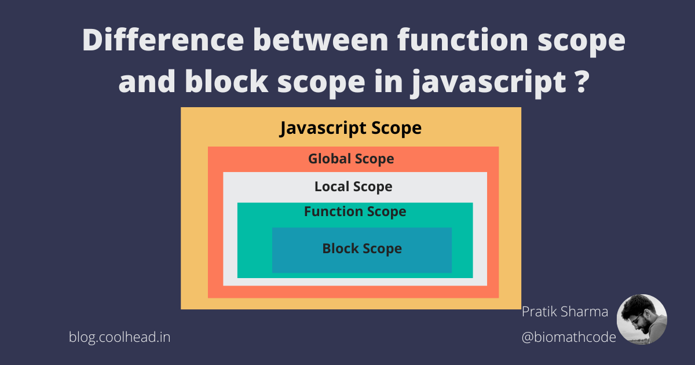

# Lecture-3
##### Эти три концепции — Scope (Область видимости), Hoisting (Поднятие) и TDZ (Временная мёртвая зона) — важны для понимания работы переменных в JavaScript.
## Scope (Область видимости)
###### Scope определяет, где в коде можно обращаться к переменной.
### Типы областей видимости:
#### Глобальная область видимости — переменная объявлена вне функции и доступна везде.
#### Функциональная область видимости — переменная объявлена внутри функции и доступна только внутри неё.
#### Блочная область видимости (начиная с ES6) — переменная объявлена внутри блока {}, например, внутри if или for, и доступна только в этом блоке.

## Hoisting (Поднятие)
###### Hoisting — это механизм, при котором объявления переменных и функций «поднимаются» в начало своей области видимости перед выполнением кода.

### Как это работает:
#### Функции, объявленные через function, полностью поднимаются и могут использоваться до их объявления.
#### Переменные, объявленные через var, поднимаются, но без значения (инициализация остаётся на месте).
#### Переменные, объявленные через let и const, поднимаются, но остаются в TDZ (см. следующий пункт).
